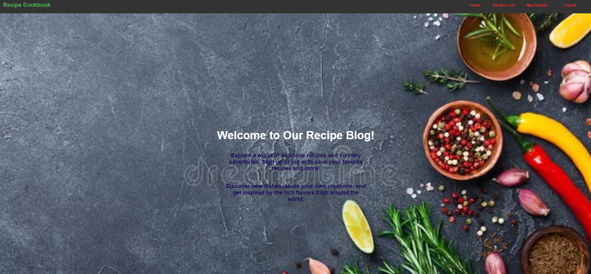
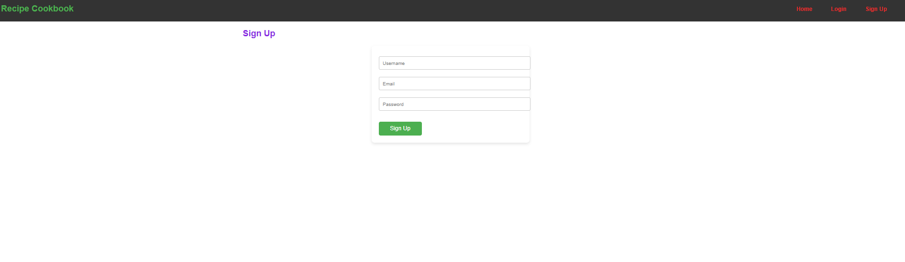

# Cook Book Blog 
 This is project is a full stack web application buill using React, Node.js, Express, MongoDB, and Bootstrap. It is a blog application where users can create, read, update, and delete recipes. 

## Installation
To run the application locally, clone the repository, navigate to the directory, and install the dependencies. You need to have Node.js and MongoDB installed on your machine. 
To install the dependencies, run the following command:

```bash
npm install
```

To run the application, run the following command:

```bash
npm run develop

```
## Screenshots 
This is homepage



This is singup page



This is the recpies page


## Contributing

Pull requests are welcome. For major changes, please open an issue first
to discuss what you would like to change.

Please make sure to update tests as appropriate.

## Watchlive 

[Live Demo](https://cook-book-blog.herokuapp.com/) ###  need to add live demo link after deployment


## License
Currently, two official plugins are available:

- [@vitejs/plugin-react](https://github.com/vitejs/vite-plugin-react/blob/main/packages/plugin-react/README.md) uses [Babel](https://babeljs.io/) for Fast Refresh
- [@vitejs/plugin-react-swc](https://github.com/vitejs/vite-plugin-react-swc) uses [SWC](https://swc.rs/) for Fast Refresh
